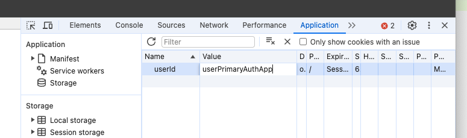

# Account Management Stubs

Repository to store stubs for services that GOV.UK One Login Account Management integrates with

## Requirements

### Pre-commit

This repository uses [pre-commit](https://pre-commit.com/) to run linting on all staged files before they're committed.
Install & setup pre-commit by running:

```bash
pip install pre-commit
pre-commit install
```

## Method Management API

The `method-management` module has a folder of models that are generated from the OpenAPI spec using `openapi-typescript`

```shell
npm install -g openapi-typescript
openapi-typescript ../../../openapi-specs/auth/method-management-api.yaml --output models/schema.d.ts
```

## Using custom scenarios

The stub API can be configure to return specific API responses based on what "scenario" is set. This can be used to test functionaltiy in the frontend, for example, if you wanted to test the case when a user has no MFA methods set.

### Enabling a custom scenario.

There is a piece of work in the backlog to create some kind of UI for this, but in the mean time...

1. Go to the stub API in dyour browser (https://oidc-stub.home.dev.account.gov.uk/)
2. In the Developer Tools, set a `userId` cookie, with the value of the scenario you want to set (you can find a list of scenarios in src/scenarios/scenarios.ts)

3. Log out and back in to One Login Home on Dev

You will then see that the API returns the responses defined for that scenario.