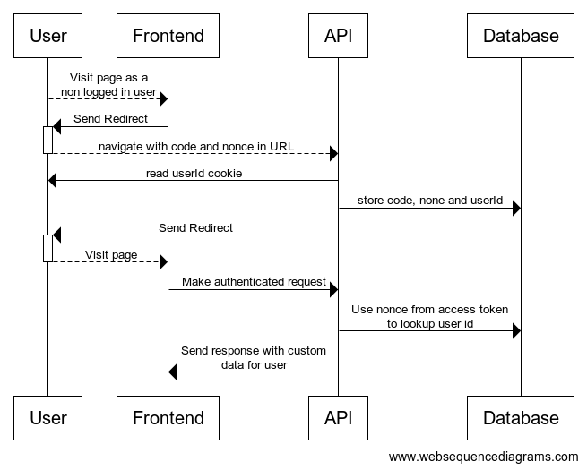

# Returning different states in the API

## Context

Currently, the stub API works quite basically; doing a very basic level of validation and responding with mostly static responses.

As we develop One Login Home, there is a need to have more flexibility in the API responses. For example, with MFA method management, we'd like to demonstrate users who have different combinations of MFA methods enabled, we can't do this with static responses.

## Option 1: Systems Manager Parameter Store

We could use the [systems manager parameter store](https://docs.aws.amazon.com/systems-manager/latest/userguide/systems-manager-parameter-store.html) to store a parameter that corresponds to a scenario. And then return the response we want.

This would work in a similar way to how we use the secrets manager currently. In the lambda we would read read the parameter from secrets manager and use it to determine the response. The parameter could be changed either through the AWS console, or through an API. We could create a simple interface in the stub api to allow people to change the current scenario.

The drawback here, is that we can only be running one scenario at a time, this may be an issue if multiple developers are working on something at the same time. Or if any tests that run rely on specific responses.

## Option 2: Pass headers through the app

When the frontend makes a request to the API, we could add a `Scenario` header, that tells the stub API which scenario to repond with. The scenario header could be taken from a header in the request to the frontend (added using a Chrome extension or similar). This would be similar to how we deal with the TxMA header.

This would solve the issue of multiple developers changing scenarios, or automated tests requiring specific scenarios.

However, this would require a significant change to the frontend API in order to pass the header through to the API requests, we may want to avoid adding this if it is just for development.

## Option 3: Switch responses based on user

We could create "profiles" of users, based on scenarios that we want to test. The return the relevant response based on which user is making the request.

We would need some way of changing the user who is logged in, this could be done by modfying the DynamoDB table to change the user id in the session token.

Potentially, we could create an API or page to facilitate this.

## Decision

We have decided to go with option 3, we will acheive this by setting a cookie on the OIDC API's domain, which will specify a user to login as. We can store this user alongside the nonce and code in DynamoDB. When an authenticated request is made, we can retrieve User ID from the database (by looking it up in the table, with the nonce from the access token).

